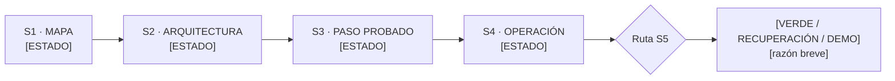

# Mapa inicial S1–S5 · [proceso]

Fecha: [AAAA-MM-DD]
Tipo de evidencia: [proceso propio / simulación didáctica]

## Resumen

- Proceso encontrado: [nombre general; sin datos sensibles]
- Sesión más avanzada con evidencia: [S1 / S2 / S3 / S4]
- Lo que está listo: [máximo dos líneas]
- Lo que falta: [máximo dos líneas]
- Lo que todavía no puede afirmarse: [dato / NADA]

## Inventario

| Sesión | Artefacto esperado | Evidencia encontrada | Estado | Qué demuestra |
|---|---|---|---|---|
| S1 | Mapa o PDF | | ENCONTRADO / INCOMPLETO / CONFIRMADO POR MÍ / NO ENCONTRADO / NO APLICA | |
| S2 | Visión, diagnóstico y decisión IA/IF | | | |
| S2 | Alcance, harness y memoria | | | |
| S2 | Skill o reglas y pruebas | | | |
| S3 | Tabla y clasificación de pasos | | | |
| S3 | Paso construido, cinco casos y número | | | |
| S4 | Recorte V1/V2 y frontera | | | |
| S4 | Cadena y corrida manual | | | |
| S4 | Trigger y gate S5 | | | |

## Diagrama

Usar `flowchart LR`, máximo 15 nodos, nombres generales y solo estados permitidos. No incluir nombres de clientes, personas, correos, montos, credenciales ni información sensible.

Leyenda: `ENCONTRADO` = archivo leído; `INCOMPLETO` = existe pero no demuestra todo; `CONFIRMADO POR MÍ` = declaración sin evidencia observable; `NO ENCONTRADO` = no apareció; `NO APLICA` = se decidió explícitamente que no era necesario.

## Huecos prioritarios

Máximo tres. No repararlos durante el mapa.

| Evidencia faltante | Por qué importa para S5 | ¿Se recupera en menos de 5 minutos? | ¿Requiere volver? |
|---|---|---|---|
| | | Sí / No | Sesión / No |

## Ruta S5 propuesta

- Ruta: [VERDE / RECUPERACIÓN / DEMO]
- Razón: [archivos concretos y faltante]
- Confirmación de la persona: [confirmada / corregida]

## Mi exposición de 60 segundos

> Mi proceso llegó hasta ___. Tengo evidencia de ___ en ___. Me falta ___. Por eso entraré a S5 por la ruta ___.
