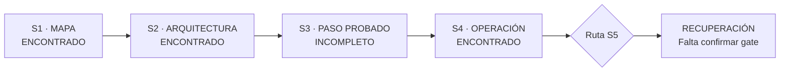

# Mapa inicial y exposición · S1 a S5

Antes de supervisar, harás visible lo que realmente existe en tu Project. El objetivo no es mostrar que “terminaste todo”; es distinguir **evidencia, huecos y siguiente ruta**.

## Prompt recomendado

Después de instalar el coach, abre una tarea nueva en el mismo Project y escribe:

> **Inicia mi S5. Primero mapea lo que realmente existe de S1 a S4, muéstrame el diagrama Mermaid, propón mi ruta y prepara mi exposición de 60 segundos.**

`Inicia mi S5.` también funciona: el mapa ya es parte obligatoria de la fase 0.

## Qué hará el coach

1. Trabajará en **solo lectura** mientras revisa S1–S4.
2. Buscará artefactos, no solo nombres de carpetas.
3. Etiquetará cada hallazgo como `ENCONTRADO`, `INCOMPLETO`, `CONFIRMADO POR MÍ`, `NO ENCONTRADO` o `NO APLICA`.
4. Agrupará archivos por función. El Mermaid tendrá máximo 15 nodos.
5. Mostrará un borrador con resumen, inventario, diagrama, máximo tres huecos y ruta propuesta.
6. Guardará `s5-kit/07-SALIDAS/mapa-inicial-s1-s5.md` solo después de tu confirmación.

Durante este bloque no modificará S1–S4, no completará documentos faltantes y no copiará datos personales, nombres de clientes, correos, montos, credenciales ni información sensible al diagrama.

El mapa cubre todos los **artefactos pedagógicos relevantes**, no cada copia técnica. El coach ignora ZIPs, duplicados y archivos de instalación cuando ya existe su fuente visible. En clase usa un máximo de 12 minutos; si no puede comprobar algo dentro de ese tiempo, lo marca `INCOMPLETO` o `NO ENCONTRADO` y continúa.

## Qué buscará

| Sesión | Evidencia principal |
|---|---|
| **S1 · Mapa** | PDF, entradas, herramientas, output, intervención humana y versión mínima |
| **S2 · Arquitectura** | Diagnóstico, decisión IA/IF/híbrido, alcance, harness, memoria, Skill o reglas y pruebas |
| **S3 · Evidencia** | Tabla de pasos, clasificación, paso construido, cinco casos, número y primera mejora |
| **S4 · Operación** | V1/V2, frontera, Skill encadenado, corrida manual, trigger y gate S5 |

## Estructura del Mermaid

El diagrama usará `flowchart LR` y mostrará la progresión completa:

El coach añadirá debajo una leyenda en texto, para que el mapa siga siendo entendible aunque Mermaid no se renderice.

## Exposición de 60 segundos

Presenta solo el diagrama y completa:

> **Mi proceso llegó hasta ___. Tengo evidencia de ___ en ___. Me falta ___. Por eso entraré a S5 por la ruta ___.**

No expliques cada archivo. El grupo necesita entender **dónde estás, qué puedes demostrar y qué harás ahora**.

## Qué significa el mapa

El mapa es obligatorio porque determina la ruta de entrada a S5. No sustituye los tres entregables de cierre: configuración, supervisión y siguiente acción.
